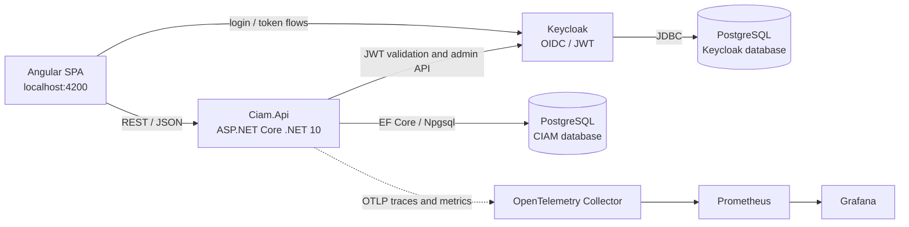

# System architecture

## Runtime responsibilities

| Component | Responsibility |
|---|---|
| Angular | UI, route protection, token attachment, profile interaction |
| Keycloak | Identity lifecycle, credentials, token issuance, verification actions |
| API | Resource authorization, application use cases, domain rules, persistence |
| PostgreSQL | Application and Keycloak persistence in separate databases |
| Collector | OTLP receiving, batching, and metrics export |
| Prometheus | Metrics storage and alert evaluation |
| Grafana | Local dashboards |
