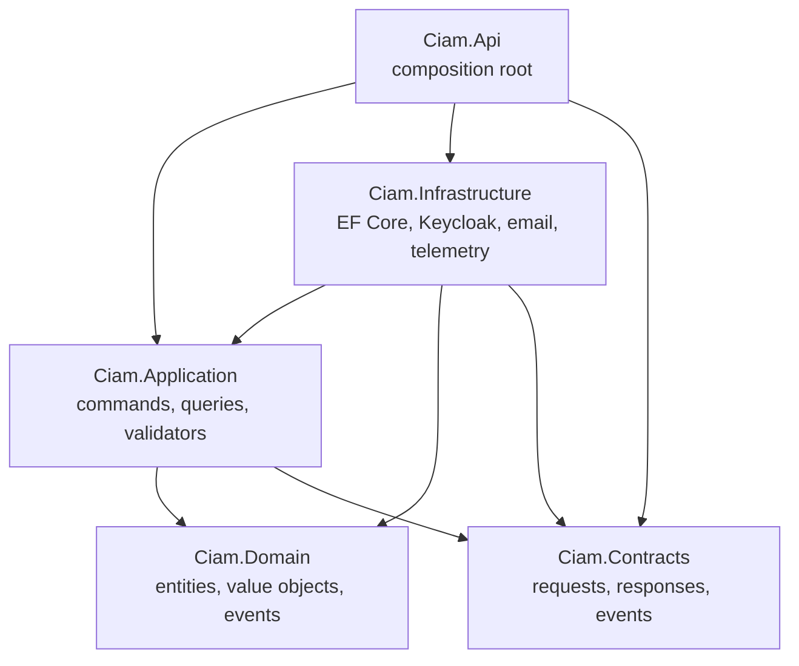

# Clean Architecture dependencies

Dependencies point inward toward stable business rules. The Domain project has
no project references.

## Boundary rules

1. Domain code must remain framework-independent.
2. Application code depends on abstractions and coordinates use cases.
3. Infrastructure implements Application and Domain interfaces.
4. API composes dependencies and exposes HTTP endpoints.
5. Contracts are transport-facing types and must not contain persistence logic.
