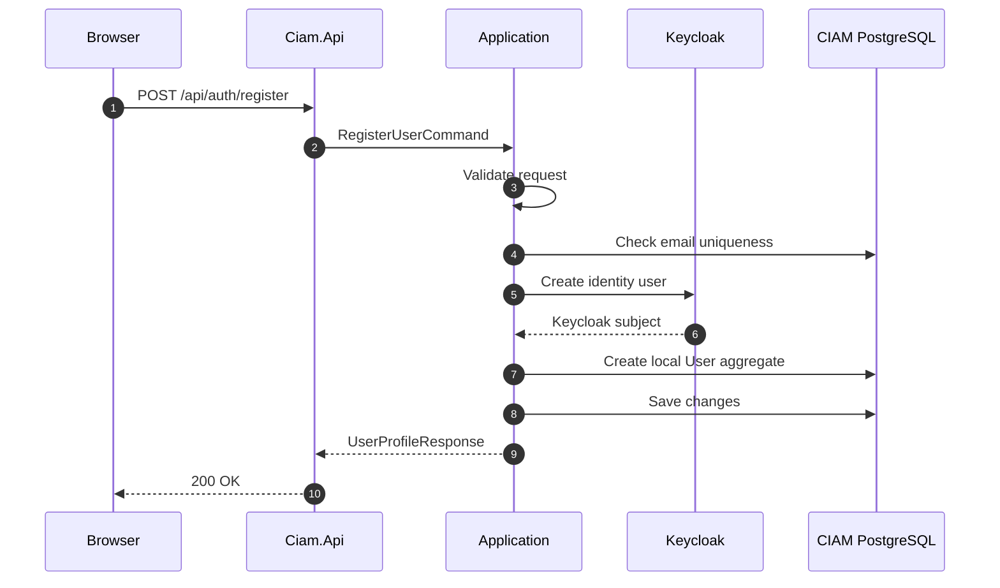
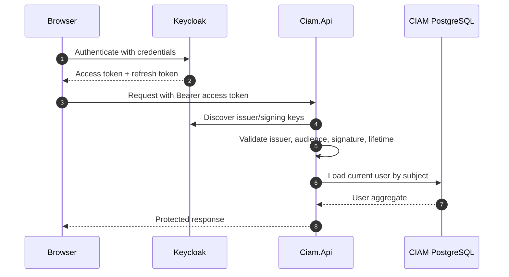

# Authentication and registration flows

## Registration

## Login and protected API access

The current API uses Keycloak-issued JWTs as a resource server. Passwordless
WebAuthn, MFA, password reset, and logout/session revocation are planned
extension points and are not represented as completed application flows here.
