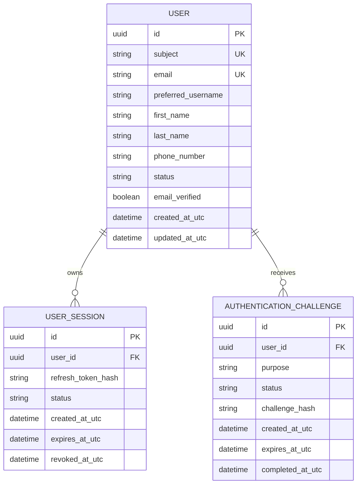

# Domain data model

The `subject` value is the Keycloak identity identifier used to associate an
authenticated JWT with the local `User` aggregate. Roles, MFA methods, and
authentication methods are persisted as configured collections in the current
EF Core mapping.
