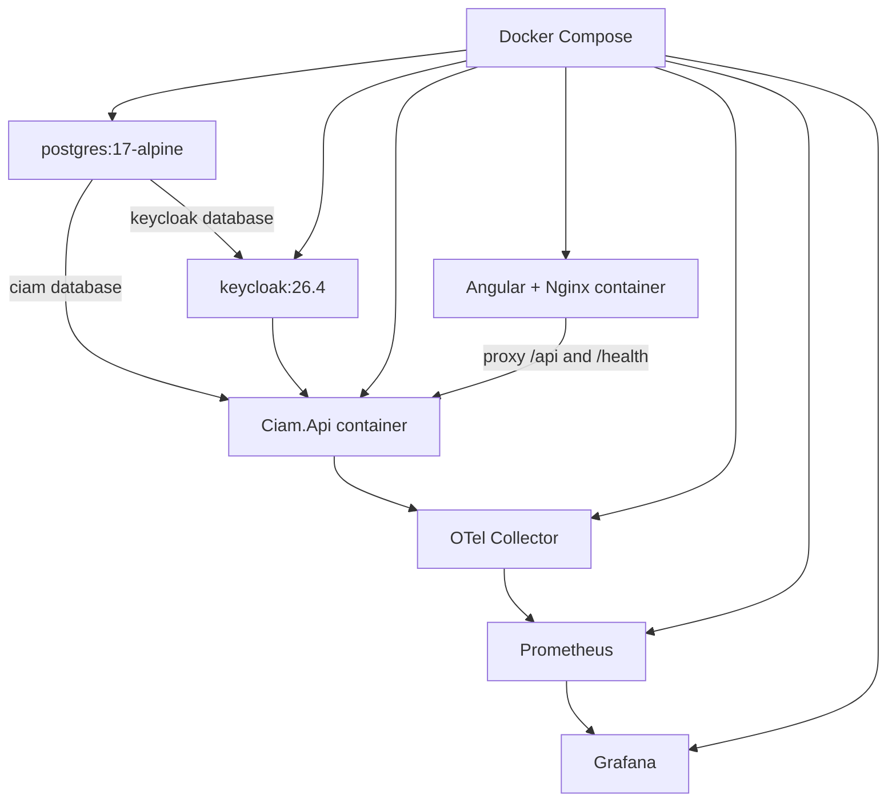
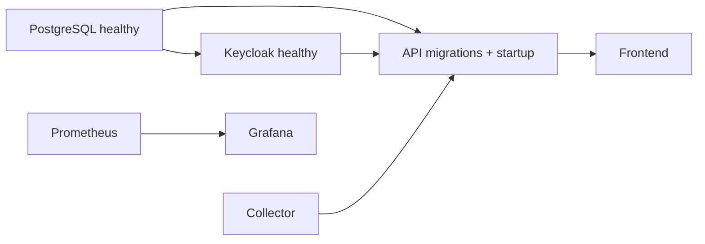

# Local infrastructure and deployment

## Startup ordering

Compose is the local development and integration environment. A production
deployment should replace Compose volume and secret defaults with managed
PostgreSQL, a secret manager, controlled EF migration jobs, TLS, ingress, and
durable telemetry storage.
