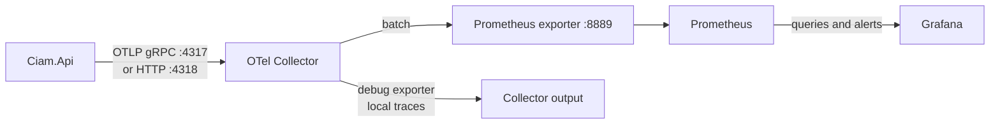

# Observability pipeline

## Signals

| Signal | Source | Current destination |
|---|---|---|
| Metrics | ASP.NET Core, HttpClient, runtime | Collector, Prometheus, Grafana |
| Traces | ASP.NET Core, HttpClient, custom activity source | Collector debug exporter |
| Logs | Serilog API logging | Console and rolling critical log files |

The local trace exporter is intentionally a debug exporter. Production should
add a durable trace backend such as Grafana Tempo or Jaeger before relying on
historical trace analysis.
