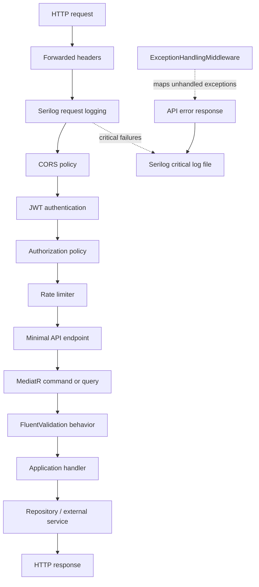
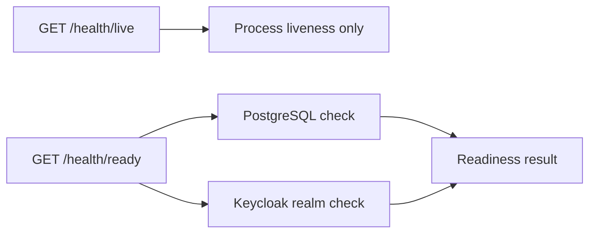

# API request and error flow

## Health endpoints

`/health/live` is suitable for process liveness probes. `/health/ready`
includes the dependencies required for the API to serve authenticated traffic.
